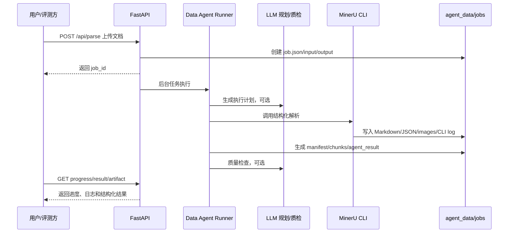

# MinerU Data Agent 技术报告

## 1. 背景与目标

本方案面向语料生产加工中的非结构化文档处理任务，目标是构建一个可复现、可追踪、可自动执行的 Data Agent。系统以 MinerU 作为底层解析能力，在此基础上补齐任务规划、工具调用、结构化归一化、日志追踪、异常恢复和质量检查能力，使其从单一解析管线升级为具备工程可落地能力的数据智能体。

系统重点解决以下问题：

- 多源文档统一结构化：支持 PDF、图片、DOCX、PPTX、XLSX 等输入。
- 执行过程可追溯：保留 Agent 阶段日志、MinerU 原始命令行日志和结构化产物路径。
- 复杂任务自动执行：上传后自动完成参数封装、MinerU 调用、结果聚合和质量检查。
- 稳定性治理：支持并发限制、超时控制、进程树清理、任务删除、残留日志读取。
- 评测友好：提供 REST API、中文前端、可下载 JSON/JSONL 结果和测试材料包。

## 2. 整体设计

系统由四层组成：

| 层级 | 模块 | 职责 |
| --- | --- | --- |
| 交互层 | React + Vite 前端 | 文档上传、参数选择、状态查看、命令行日志、结果下载、任务删除 |
| 服务层 | FastAPI 后端 | 提供异步任务 API、任务状态管理、结果文件下载 |
| Agent 层 | `backend/agent_runner.py` | 任务理解、规划、MinerU 调用、结构化聚合、质量检查、异常处理 |
| 工具层 | MinerU CLI + `process_documents_with_mineru.py` | 文档解析、Markdown/JSON 产出、JSONL 片段归一化 |

核心数据流：



## 3. 任务执行机制

每个任务以 `job_id` 作为唯一标识，任务目录位于 `agent_data/jobs/{job_id}`。执行阶段如下：

1. 输入校验：检查后缀是否属于支持范围，保存原始上传文件。
2. 任务入队：写入 `job.json`，状态为 `queued`。
3. 并发控制：通过 `DATA_AGENT_MAX_RUNNING_JOBS` 限制同时运行的 MinerU 任务，默认 `1`。
4. 任务理解：记录输入文件名、路径和解析参数。
5. 执行规划：若配置 LLM，则调用 OpenAI 兼容接口生成计划；否则使用规则计划。
6. 工具调用：构造 MinerU CLI 命令并启动子进程。
7. 实时日志：将 MinerU stdout/stderr 写入 `mineru_cli.log`，前端通过 `/progress` 与 `/cli-log` 查看。
8. 结构化归一化：读取 MinerU 产物，生成 `structured_manifest.json` 与 `structured_chunks.jsonl`。
9. 质量检查：基于 manifest 和片段预览输出质量结论与改进建议。
10. 结果落盘：写入 `agent_result.json`，更新 `job.json` 为 `succeeded` 或 `failed`。

## 4. 数据处理与工具调用能力

### 4.1 MinerU 解析能力封装

系统通过 MinerU CLI 调用底层解析能力，支持参数：

- `backend`：`pipeline`、`hybrid-auto-engine`、`vlm-auto-engine` 等。
- `method`：`auto`、`txt`、`ocr`。
- `lang`：OCR 语言提示，如 `ch`、`en`。
- `formula`：是否启用公式解析。
- `table`：是否启用表格解析。
- `image_analysis`：是否启用图像分析。
- `start_page/end_page`：页码范围控制。

### 4.2 结构化结果规范

`structured_manifest.json` 负责文档级索引：

- 输入路径、输出路径、MinerU 命令。
- 每个文档的 Markdown、content_list、middle_json、model_json、图片目录路径。
- 元素类型统计，如 `text`、`table`、`equation`、`image`、`chart`。
- 总文档数和总片段数。

`structured_chunks.jsonl` 负责元素级结构化片段：

```json
{
  "document": "2211_reduced_policy_optimization_fo",
  "element_id": "2211_reduced_policy_optimization_fo:000001",
  "element_index": 1,
  "type": "text",
  "page_idx": 0,
  "text": "Reduced Policy Optimization ...",
  "bbox": null,
  "media_path": null,
  "raw": {}
}
```

这种 JSONL 格式便于后续进入 RAG、知识库构建、向量化、审计抽样和批量质量评测。

### 4.3 LLM 规划与质量检查

LLM 调用采用 OpenAI 兼容 `/chat/completions` 接口：

- 规划器输入：文件名、解析参数。
- 规划器输出：`goal`、`steps`、`risk_controls`。
- 质检器输入：manifest 摘要、文档列表、片段预览。
- 质检器输出：`verdict`、`checks`、`suggestions`。

当 LLM 未配置或调用失败时，系统自动降级为规则计划和规则质检，不影响 MinerU 主流程。

## 5. 稳定性与工程成熟度

| 能力 | 实现方式 |
| --- | --- |
| 并发控制 | 后端 `BoundedSemaphore` 限制同时运行任务数 |
| 超时治理 | `DATA_AGENT_JOB_TIMEOUT_SECONDS` 控制单任务超时 |
| 进程清理 | 记录 MinerU 子进程，删除任务时清理进程树 |
| 残留任务处理 | 任务记录缺失时仍可读取 orphan 输出目录和 CLI 日志 |
| 原子写入 | `job.json` 使用临时文件替换，降低状态文件损坏概率 |
| 编码兼容 | 读取 MinerU 输出时尝试 UTF-8、系统编码、GB18030、GBK |
| 前端轮询 | 仅在存在 `queued/running` 任务时自动刷新，避免长期无意义请求 |
| 可观察性 | 提供 `/progress`、`/cli-log`、`job.logs` 和可下载日志文件 |

## 6. 性能与成本说明

本机验证结果表明：

- 小型 DOCX 冒烟任务约 25 秒完成，生成 4 个结构化片段。
- 中型 DOCX 论文任务约 67 秒完成，生成 334 个结构化片段。
- 26 页 PDF 在关闭公式和表格解析时约 123 秒完成，生成 272 个结构化片段。
- 同一 PDF 启用公式和表格解析时进入 `MFR Predict`，在 1800 秒超时上限下停止于 224/315，说明公式密集 PDF 对算力和耗时敏感。

成本策略：

- 普通文本/版面抽取优先使用 `pipeline + auto`。
- 公式密集文档可按需求启用 `formula`，并提高超时上限或使用 GPU。
- 只需正文结构化时可关闭 `formula/table` 以显著降低耗时。
- LLM 只参与规划和质检，不参与全文重写，降低 Token 成本并减少幻觉风险。

## 7. 五个典型任务执行示例

| 示例 | 输入 | 参数 | 结果 | 价值 |
| --- | --- | --- | --- | --- |
| 1. PDF 论文结构化 | `2211_reduced_policy_optimization_fo.pdf` | `formula=false, table=false, use_llm=true` | 成功，1 文档，272 片段 | 验证 PDF 正文、图表、公式元素统计和 JSONL 产出 |
| 2. PDF 公式压力测试 | 同一 PDF | `formula=true, table=true, use_llm=true` | 超时失败，MFR 进度 224/315 | 验证复杂任务进度可见、超时治理和异常日志 |
| 3. DOCX 长文档解析 | `模型和数据联合驱动...docx` | `formula=true, table=true, use_llm=true` | 成功，1 文档，334 片段 | 验证 Office 文档结构化和图片抽取 |
| 4. DOCX 冒烟测试 | `1.docx` | `use_llm=false` | 成功，1 文档，4 片段 | 验证无 LLM 降级路径和最小任务闭环 |
| 5. 任务观测与清理 | 任意运行中任务 | `DELETE /api/jobs/{job_id}` | 清理任务目录并尝试终止进程 | 验证运行中任务可停止，避免持续占用资源 |

详细日志和结果见 `docs/测试日志与结果.md` 与 `docs/test_results/`。

## 8. 适用场景与应用价值

适用场景：

- 语料生产：批量将 PDF、Office、图片资料转为统一结构化数据。
- 学术论文处理：抽取标题、正文、公式、表格、图片和参考信息。
- 企业知识库：将历史文档转换为 JSONL 片段，供向量化和 RAG 使用。
- 质量审计：通过 manifest、CLI log 和 Agent log 追溯每个结果的来源。
- 评测平台：通过 API 提交任务并下载结果，便于自动化验收。

应用价值：

- 将 MinerU 的解析能力工程化为可评测的 Data Agent。
- 通过日志、进度和质量报告降低“黑盒解析”的不确定性。
- 支持 LLM 可选接入，在成本可控的前提下增强规划和质检能力。
- 支持失败任务可解释、可清理、可复现，符合生产环境要求。

## 9. 后续优化方向

- 增加批量任务调度与优先级队列。
- 为财报、工程图、表格密集文档增加领域专用校验器。
- 增加结构化结果的 Schema 校验和覆盖率指标。
- 接入对象存储，支持大规模任务产物归档。
- 增加公网鉴权、限流、上传大小限制和多租户隔离。

## 10. 新增四类增强模块

系统已补充 `backend/enhancements.py`，在 MinerU 前后执行四类专家增强模块。增强模块采用“可用则调用、不可用则记录跳过原因、不阻断主流程”的策略，最终输出 `enhancement_report.json`，并同步进入 `agent_result.json`。

| 增强模块 | 执行时机 | 面向难点 | 当前能力 |
| --- | --- | --- | --- |
| 图像预处理 | MinerU 前 | 模糊、光照不均、拍照件 | 对图片输入检测模糊度、亮度、对比度；若安装 OpenCV/numpy，则自动锐化、CLAHE 对比度增强、局部阈值，并生成增强图片作为有效输入 |
| 财报/密集数字校验 | MinerU 后 | 财报数字幻觉、OCR 数字混淆、表格格式风险 | 扫描财务关键词、密集数字片段、合计行、异常逗号分组、数字中夹杂 O/I/l 等风险 |
| 复杂图表候选解析 | MinerU 后 | 图表无法直接变成结构化表格 | 从 MinerU 输出的 chart/image/manifest images 中提取候选区域，记录图片路径和尺寸；后续可接 DePlot、ChartOCR 或 VLM 服务 |
| 跨页合并与指代分析 | MinerU 后 | 跨页表格、全局指代消解 | 检测相邻页连续表格候选，扫描“上述、本公司、该项目、this/that”等指代词并给出候选上下文 |

增强报告示例：

```json
{
  "job_id": "xxx",
  "routing": {
    "modules": [
      "image_preprocess",
      "financial_table_validator",
      "chart_parser",
      "cross_page_merge"
    ],
    "policy": "始终记录四类增强模块的执行或跳过原因；可选依赖缺失时不中断 MinerU 主流程。"
  },
  "pre_mineru": {
    "modules": []
  },
  "post_mineru": {
    "modules": []
  }
}
```

这部分体现 Data Agent 的工具编排能力：系统不再是单一 MinerU 管线，而是由 Agent 根据输入和解析结果自动路由增强模块，记录工具调用、候选结果、风险提示、跳过原因和可下载产物。
