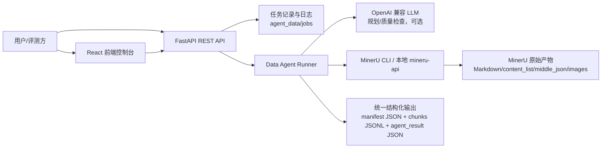

# MinerU Data Agent 系统部署与运行说明

## 1. 系统概述

本系统以 MinerU 作为第一解析模块，在其上封装 Data Agent 能力：任务理解、执行规划、MinerU 工具调用、结构化结果归一化、质量检查、运行日志追踪和前端可视化。系统采用前后端分离架构，后端提供 FastAPI 异步任务接口，前端提供中文 Web 控制台。



## 2. 运行环境要求

| 类别 | 最低要求 | 推荐配置 |
| --- | --- | --- |
| 操作系统 | Windows 10/11 x64 | Windows 11 x64 |
| Python | 3.11 | 当前验证版本：Python 3.11.15 |
| Node.js | 20+ | 当前验证版本：Node.js 24.12.0 / npm 11.6.2 |
| 后端依赖 | mineru、fastapi、uvicorn、openai/httpx、psutil | 当前验证：mineru 3.1.15、FastAPI 0.136.1、Uvicorn 0.47.0 |
| 内存 | 8 GB | 16 GB 及以上 |
| GPU | 非必需 | OCR、公式识别、复杂 PDF 建议 6 GB 以上显存 |
| 磁盘 | 10 GB 可用空间 | 20 GB 以上，便于缓存模型和保留任务产物 |

说明：在 CPU 或低显存环境下，PDF 公式识别阶段可能较慢。系统提供 `DATA_AGENT_JOB_TIMEOUT_SECONDS` 控制单任务超时，并支持删除任务时清理后端进程。

## 3. 目录结构

```text
D:\vscodepro\MinerU
├── backend/                         FastAPI 后端服务
├── frontend/                        React + Vite 前端
├── process_documents_with_mineru.py MinerU 结构化封装脚本
├── agent_data/jobs/                 任务输入、日志和结果
├── outputs/                         独立脚本默认输出目录
└── docs/                            本次提交说明与测试材料
```

每个任务会写入：

```text
agent_data/jobs/{job_id}/
├── input/                           原始上传文件
├── job.json                         任务状态、参数、执行步骤、日志和结果摘要
└── output/
    ├── mineru_cli.log               MinerU 命令行实时日志
    ├── structured_manifest.json     结构化索引
    ├── structured_chunks.jsonl      元素级 JSONL 片段
    └── agent_result.json            Data Agent 最终结果
```

## 4. 后端启动

在项目根目录执行：

```powershell
cd D:\vscodepro\MinerU

$env:OPENAI_API_BASE="https://bk.xiaozhiai.cc/v1"
$env:OPENAI_API_KEY="<YOUR_API_KEY>"
$env:OPENAI_MODEL="glm-4"
$env:DATA_AGENT_MAX_RUNNING_JOBS="1"
$env:DATA_AGENT_JOB_TIMEOUT_SECONDS="1800"

.\.venv_mineru\python.exe -m uvicorn backend.main:app --host 127.0.0.1 --port 8765
```

环境变量说明：

| 变量 | 说明 | 默认值 |
| --- | --- | --- |
| `OPENAI_API_BASE` | OpenAI 兼容模型服务地址，用于规划和质量检查 | 未配置时关闭 LLM |
| `OPENAI_API_KEY` | 模型服务密钥 | 未配置时关闭 LLM |
| `OPENAI_MODEL` | 使用的模型名 | `glm-4` |
| `DATA_AGENT_MAX_RUNNING_JOBS` | 同时运行的 MinerU 任务数 | `1` |
| `DATA_AGENT_JOB_TIMEOUT_SECONDS` | 单任务超时秒数 | `1800` |
| `MINERU_BIN` | MinerU CLI 路径 | `.venv_mineru\Scripts\mineru.exe` |
| `MINERU_MODEL_SOURCE` | MinerU 模型源 | `modelscope` |

健康检查：

```powershell
Invoke-RestMethod http://127.0.0.1:8765/api/health
```

预期返回：

```json
{
  "status": "ok",
  "service": "mineru-data-agent",
  "mineru_available": true,
  "llm_configured": true,
  "supported_inputs": [".pdf", ".docx", ".pptx", ".xlsx", ".png"]
}
```

## 5. 前端启动

```powershell
cd D:\vscodepro\MinerU\frontend
npm install
$env:VITE_API_BASE="http://127.0.0.1:8765"
npm run dev -- --host 127.0.0.1 --port 5173
```

浏览器访问：

```text
http://127.0.0.1:5173
```

前端支持上传文件、选择解析参数、查看任务状态、查看实时进度、查看 MinerU 命令行日志、下载结构化结果，并可删除运行中或历史任务。

## 6. 命令行独立运行

如果只需要使用 MinerU 结构化封装脚本，可直接运行：

```powershell
cd D:\vscodepro\MinerU
.\.venv_mineru\python.exe process_documents_with_mineru.py `
  -i .\agent_data\jobs\34d2004785ed4f188517bcfa073d7316\input\2211_reduced_policy_optimization_fo.pdf `
  -o .\outputs `
  -b pipeline `
  -m auto `
  -l ch `
  --no-formula `
  --no-table
```

输出文件：

```text
outputs/structured_manifest.json
outputs/structured_chunks.jsonl
```

## 7. 测试方法

### 7.1 Web 控制台测试

1. 启动后端和前端。
2. 打开 `http://127.0.0.1:5173`。
3. 上传 PDF、DOCX 或图片文件。
4. 点击“运行 Agent”。
5. 在“计划、日志、命令行、片段、文件”标签中查看执行过程。
6. 在“文件”标签下载 `structured_manifest.json`、`structured_chunks.jsonl`、`agent_result.json`。

### 7.2 API 测试

```powershell
$file = "D:\vscodepro\MinerU\agent_data\jobs\02876e2fbe44429894c09ddd50dc7ab4\input\1.docx"
$form = @{
  file = Get-Item $file
  backend = "pipeline"
  method = "auto"
  lang = "ch"
  formula = "true"
  table = "true"
  use_llm = "false"
}

$job = Invoke-RestMethod -Method Post -Uri http://127.0.0.1:8765/api/parse -Form $form
Invoke-RestMethod http://127.0.0.1:8765/api/jobs/$($job.job_id)/progress
Invoke-RestMethod http://127.0.0.1:8765/api/jobs/$($job.job_id)/result
```

## 8. 日志查看方式

| 日志类型 | 查看方式 |
| --- | --- |
| 后端服务日志 | 启动 Uvicorn 的终端窗口 |
| Agent 阶段日志 | `GET /api/jobs/{job_id}` 中的 `logs` 字段 |
| MinerU CLI 日志 | `GET /api/jobs/{job_id}/cli-log` 或 `agent_data/jobs/{job_id}/output/mineru_cli.log` |
| 实时进度 | `GET /api/jobs/{job_id}/progress` |
| 最终结果 | `agent_data/jobs/{job_id}/output/agent_result.json` |

常见进度阶段：

| 阶段 | 含义 |
| --- | --- |
| `queue` | 等待可用 MinerU worker |
| `understand` | 输入校验与任务理解 |
| `plan` | 生成执行计划 |
| `execute` | 调用 MinerU |
| `Layout Predict` | 版面分析 |
| `MFR Predict` | 数学公式识别 |
| `structure` | 聚合 Markdown/JSON 并生成 JSONL |
| `verify` | 质量检查 |
| `finished` | 任务完成 |

## 9. 复现与验收说明

本项目已经在本机完成如下验证：

```powershell
cd D:\vscodepro\MinerU\frontend
npm run build

cd D:\vscodepro\MinerU
.\.venv_mineru\python.exe -m compileall backend process_documents_with_mineru.py
Invoke-RestMethod http://127.0.0.1:8765/api/health
```

验证结果：

- 前端 TypeScript 与 Vite 构建通过。
- 后端 Python 编译检查通过。
- 后端健康检查返回 `status=ok`、`mineru_available=true`。
- Web 控制台中文界面已通过浏览器检查。

## 10. 注意事项

- 本地服务默认未开启鉴权，适合比赛本机复现或内网评测。如部署到公网，建议在 Nginx/API Gateway 层增加 Bearer Token、IP 白名单和上传大小限制。
- 不要将真实 `OPENAI_API_KEY` 写入代码、文档或版本库。应通过环境变量、密钥管理服务或容器 Secret 注入。
- 复杂 PDF 打开公式解析时可能进入较长的 `MFR Predict` 阶段；如评测侧更关注正文结构化，可关闭公式解析以显著降低运行时间。
- 删除任务会同时尝试终止对应 MinerU 进程树，并清理任务目录。

## 11. 增强模块运行说明

新版本在 MinerU 前后增加四个增强模块：

- 图像预处理：图片输入可调用 OpenCV/numpy 做质量检测和增强。
- 财报/密集数字校验：扫描财务关键词、密集数字、异常数字格式和 OCR 混淆。
- 复杂图表候选解析：提取 chart/image 候选区域，供 DePlot、ChartOCR 或 VLM 进一步解析。
- 跨页合并与指代分析：输出跨页表格候选和全局指代候选。

可选依赖：

```powershell
.\.venv_mineru\python.exe -m pip install opencv-python numpy pillow
```

输出文件：

```text
agent_data/jobs/{job_id}/output/enhancement_report.json
agent_data/jobs/{job_id}/output/enhancements/
```

下载接口：

```text
GET /api/jobs/{job_id}/artifact/enhancement_report
```

前端新增“增强”标签页，用于查看四个模块的状态、工具调用、跳过原因、风险提示和产物路径。
